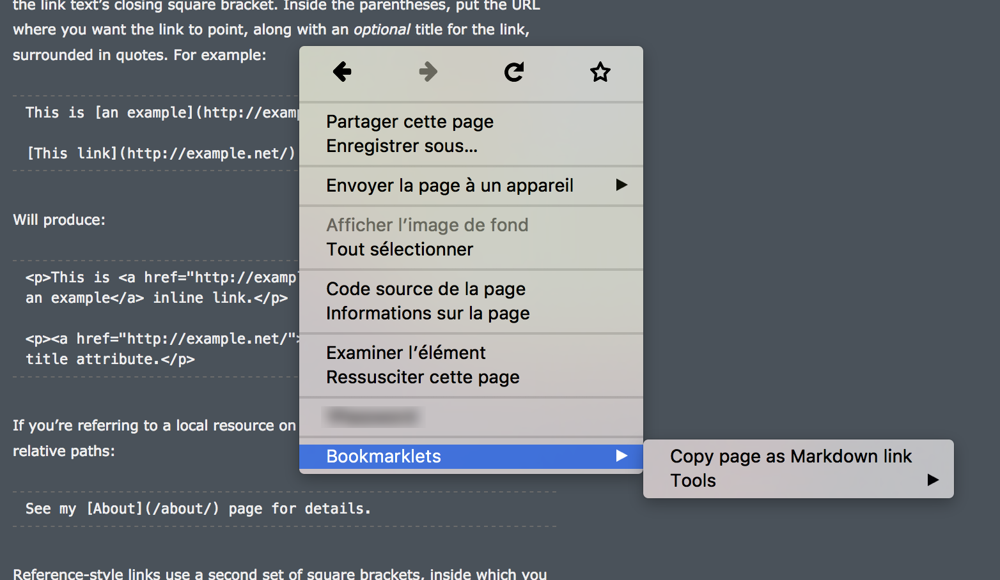
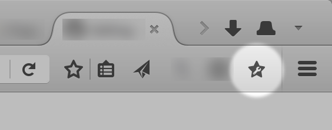

This extension is available for [Firefox (via AMO)](https://addons.mozilla.org/firefox/addon/bookmarklets-context-menu/)

## Why use Bookmarklets context menu

[Current browsers' implementations of bookmarklets are broken](#why-current-browsers-implementations-of-bookmarklets-are-broken): bookmarklet are executed as author's script, but should be executed as user's scripts (with higher pivileges).

To circumvent this restrictions, the extension _Bookmarklets context menu_ create a context menu with all bookmarklets available from user's bookmarks and executed it on demand as [content script](https://developer.mozilla.org/Add-ons/WebExtensions/Content_scripts). This allow access to a secured isolated environement, with higher privileges than author's scripts.

<!--
This context is defined as:

- `this` (global) is an extended `Window` object, include a small subset of WebExtension APIs and [DOM object `wrappedJSObject` property](https://developer.mozilla.org/en-US/Add-ons/WebExtensions/Content_scripts#Accessing_page_script_objects_from_content_scripts): `const Sandbox = {browser, chrome, ...window}`
- `self` is the same as `window`, the top frame's global object
-->

Note: Prior [Firefox 58](https://bugzilla.mozilla.org/show_bug.cgi?id=1267027) ([Intent to implement](https://groups.google.com/forum/m/#!msg/mozilla.dev.platform/EVKMSAY__lA/8b1ctuJgBwAJ), [1406278](https://bugzilla.mozilla.org/show_bug.cgi?id=1406278)), **CSP still applied to subresources** (like scripts, styles, medias, etc.). That means with a super strict CSP "none", you can't use any additional scripts, styles nor medias.

If you need to load a resource, create an iframe with an "unique origin" ([`allow-same-origin` disabled](https://developer.mozilla.org/docs/Web/HTML/Element/iframe#attr-sandbox)) or with a data URI (Firefox 57+, see [1324406 - Treat 'data:' documents as unique, opaque origins](https://bugzilla.mozilla.org/show_bug.cgi?id=1324406)):

	// On a page with a strict CSP like `default-src 'self'`	
	let iframe = document.createElement("iframe");
	iframe.srcdoc = `<html><head></head><body></body></html></iframe>`;
	iframe.sandbox = "allow-scripts";
	document.body.appendChild(iframe);

If the page block the context menu, you can use the browser action of context menu:

## Why current browsers' implementations of bookmarklets are broken?

> consider users over authors over implementors over specifiers over theoretical purity.

— [HTML Design Principles](https://www.w3.org/TR/html-design-principles/#priority-of-constituencies)

With current implementation, bookmarklet usage is restricted because bookmarklets are not executed as privileged scripts, but as author's script.
That means bookmarklet are subject to security measures like <abbr title="Content Security Policy">CSP</abbr> and <abbr title="Cross-Origin Resource Sharing">CORS</abbr> which make it difficulte to use or impossible in some cases.

See also [Wiki pages](https://github.com/mems/bookmarklets-context-menu/wiki)

## Limitations of this extension

This doesn't fix broken implementations. It's just an alternative.

- work well on Firefox Desktop, untested on Chrome and any other browser that support [WebExtension API](https://developer.mozilla.org/en-US/Add-ons/WebExtensions)
- [Edge don't support bookmarks WebExtension API](https://developer.mozilla.org/Add-ons/WebExtensions/API/bookmarks#Browser_compatibility)
- options UI looks ugly, see [1275287 - Implement `chrome_style` in options V2 API.](https://bugzilla.mozilla.org/show_bug.cgi?id=1275287)

## Permissions required by the extension

The following permissions are used by the extension:

- `bookmarks`: read the bookmark tree to get all bookmarklets
- `contextMenus`: create context menus based on bookmarklets founded in bookmarks
- `activeTab`: execute bookmarklet script in the active tab
- `clipboardWrite` and `clipboardRead`: allow to use [`document.execCommand('cut'/'copy'/'paste')`](https://developer.mozilla.org/Add-ons/WebExtensions/Interact_with_the_clipboard) in bookmarklets
- `storage`: store some preferences like "flat context menu"
- `<all_urls>`: allow bookmarklets to perform `fetch()` or `XMLHttpRequest` without crossdomain limitations

## How to write a bookmarklet

**It's not recommended to use external resources.** But if you need external resources instead of load if with link, script or media tags (which are affected by CSP and CORS), use `fetch()` or `XMLHttpRequest`, and inject it with blob URI, data URI or inline (`style` and `script` tags). **Always load it with HTTPS.**

If the result of the bookmarklet is other than `undefined` (`void 0`), it will be used as HTML source of a new document opened in the same tab: `javascript:"Underlined text"`

An example of a bookmarklet that copy the document's title (`document.title`):

	javascript:(s=>{let%20d=document,l=e=>{d.removeEventListener("copy",l);e.preventDefault();e.clipboardData.setData("text/plain",s);};if(d.activeElement.tagName=="IFRAME"){let%20s=d.createElement("span");s.tabIndex=-1;s.style.position="fixed";d.body.appendChild(s);s.focus();s.remove()}d.addEventListener("copy",l);d.execCommand("copy");a.focus()})(document.title)

An example of a bookmarklet that copy the page as [Markdown link](https://github.com/adam-p/markdown-here/wiki/Markdown-Cheatsheet#links):

	javascript:{let%20e=document,t=e.URL,a=[e.title].concat(Array.from(e.querySelectorAll("h1,h2")),t).reduce((e,t)=>e||t.textContent&&t.textContent.trim().replace(/\s+/g,"%20")||t.trim(),""),n=(e,t,a="&%23x",n=";")=>e.replace(t,e=>a+e.charCodeAt(0).toString(16).padStart(2,"0")+n),r=n(t,/[()"]/g,"%25",""),l=e.contentType.startsWith("image/"),[,i="Untitled"]=/\/([^/.]+$|[^/]+(?=\.[^.]*$))/g.exec(new%20URL(t).pathname)||[];i+="."+e.contentType.split("/")[1].split("+")[0];let%20c=o=>{let%20p=o.clipboardData,d=p.setData.bind(p);e.removeEventListener("copy",c),o.preventDefault(),p.clearData(),d("text/x-moz-url",t),d("text/uri-list",t),d("text/html",l?`]/g)}">`:`<a%20href="${r}">${n(a,/[&<>]/g)}</a>`),d("text/plain",l||a!==t?(l?"!":"")+"["+(l?i:a).replace(/[\\<>\[\]]/g,"\\$&")+"]("+r+")":r)};if(["IFRAME","FRAME"].includes(e.activeElement.tagName)){let%20t=e.createElement("span");t.tabIndex=-1,t.setAttribute("aria-hidden","true"),t.style.position="fixed",e.documentElement.appendChild(t),t.focus(),t.remove()}e.addEventListener("copy",c),e.execCommand("copy")}void(0)

If you get the following error `Bookmarklet error: SecurityError: The operation is insecure.`, that means you use `document.write(potentiallyUnsafeHTML)`, when you should use `wrappedJSObject.document.write(potentiallyUnsafeHTML)` instead. It's related to content script (privilegied) context vs page context.

Note: It's impossible for the extension to catch asynchronous errors (in listener, setTimeout, etc.) even with a global error handler. You must use a `try...catch` block in your asynchronous functions. Alternatively you can use the add-ons debug mode [`about:debugging`](https://developer.mozilla.org/en-US/docs/Tools/about:debugging#Add-ons)

If you need `document.execCommand()`, be sure there is no element in / iframe focused:

	// execCommand will not been executed if a frame or an iframe is focused
	if(["IFRAME","FRAME"].includes(document.activeElement.tagName)){
		let focusable = document.createElement("span");
		focusable.tabIndex = -1;// focusable
		focusable.setAttribute("aria-hidden", "true");// will not be announced by AT
		focusable.style.position = "fixed";
		document.documentElement.appendChild(focusable);// don't use doc.body because in case of frame the body is the frameset and execCommand will not work
		focusable.focus();// force focus, but will not scroll into view, because it have fixed position
		focusable.remove();// remove focus, without force to scroll into view to an other element
	}
	let listener = event => {
		document.removeEventListener("copy", listener);// one time listener
		// Do whaterver you want. Exemple: in copy event, use event.clipboardData
	};
	document.addEventListener("copy", listener);
	document.execCommand("copy");// will dispatch copy event

See also:

- [Bookmarkleter](http://chriszarate.github.io/bookmarkleter/)
- [Bookmarklet - Wikipedia](https://en.wikipedia.org/wiki/Bookmarklet#Concept)
- [Create Bookmarklets - The Right Way](https://code.tutsplus.com/tutorials/create-bookmarklets-the-right-way--net-18154)
